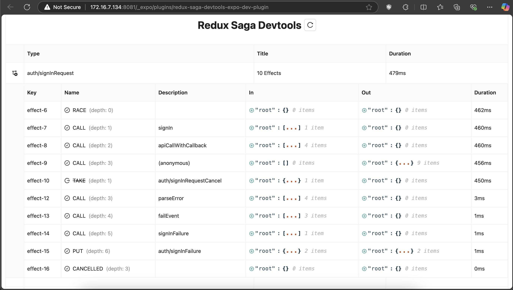

# redux-saga-devtools-expo-dev-plugin

A React Native Redux Saga DevTool that can run in an Expo App

# Installation

### Add the package to your project

```
npx expo install redux-saga-devtools-expo-dev-plugin
```

### Integrate redux saga with the DevTool hook

```jsx
import createSagaMiddleware from 'redux-saga';

let sagaMiddleware = createSagaMiddleware();
if (__DEV__) {
  // eslint-disable-next-line @typescript-eslint/no-var-requires
  const { createSagaMonitor } = require('redux-saga-devtools-expo-dev-plugin');
  sagaMiddleware = createSagaMiddleware({ sagaMonitor: createSagaMonitor() });
}

const store = configureStore({
  reducer: rootReducer,
  devTools: false,
  middleware: (getDefaultMiddleware) => getDefaultMiddleware().concat(sagaMiddleware),
});
```

## 🎬 Preview

<a href="https://github.com/SimformSolutionsPvtLtd/redux-saga-devtools-expo-dev-plugin"> </a>

## Awesome Mobile Libraries

- Check out our other [available awesome mobile libraries](https://github.com/SimformSolutionsPvtLtd/Awesome-Mobile-Libraries)

## License

- [MIT License](./LICENCE)

## Credits and Inspiration

- This Plugin was inspired by [reactotron-redux-saga](https://github.com/infinitered/reactotron-redux-saga) provided in [infinitered](https://infinite.red/), which is now deprecated. We acknowledge the valuable work of the original authors and have built upon their foundation while making updates and improvements to support expo.

